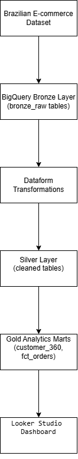
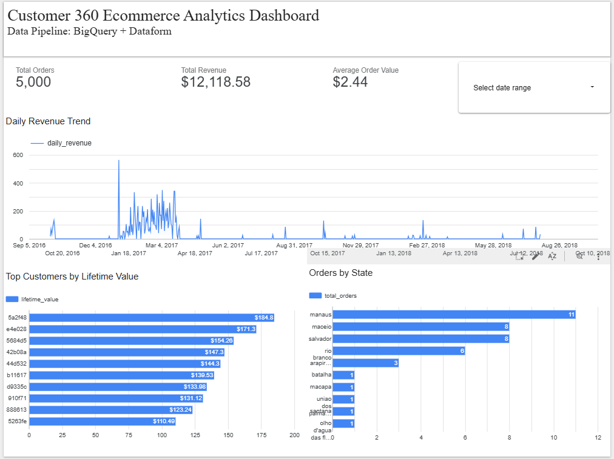

---

# Customer 360 Data Engineering Pipeline on GCP

---

## Overview

This project implements a **Customer 360 analytics pipeline on Google Cloud Platform** using **BigQuery, Dataform, and Looker Studio**.

The pipeline transforms raw e-commerce data into analytics-ready tables using a **Medallion Architecture (Bronze → Silver → Gold)** and supports **incremental processing and late-arriving data handling**.

The final output is a **business dashboard providing insights into customer behavior, revenue trends, and geographic order distribution.**

---

## Project Demo

### Architecture



### Analytics Dashboard


https://lookerstudio.google.com/reporting/b1c3db47-6d34-428f-bbe4-a43c34fef63e

---

## Architecture


Pipeline flow:

```
Brazilian E-commerce Dataset
        │
        ▼
BigQuery Bronze Layer (Raw Tables)
        │
        ▼
Dataform Transformations
        │
        ▼
Silver Layer (Cleaned Tables)
        │
        ▼
Gold Analytics Marts
(customer_360, fct_orders)
        │
        ▼
Looker Studio Dashboard
```

---

## Technologies Used

| Technology          | Purpose                      |
| ------------------- | ---------------------------- |
| **Google BigQuery** | Data warehouse               |
| **Dataform**        | SQL transformation framework |
| **Looker Studio**   | Data visualization           |
| **GitHub**          | Version control              |
| **SQL**             | Data transformation          |
| **Cloud IAM**       | Service account permissions  |

---

## Project Structure

```
customer360-gcp-data-pipeline
│
├── architecture
│   └── customer360_architecture.png
│
├── dashboard
│   └── customer360_dashboard.png
│
├── dataform
│   ├── bronze
│   ├── silver
│   ├── gold
│   └── assertions
│
├── sample_data
│
└── setup
    ├── bronze_setup.sql
    ├── dataset_reduction.sql
    └── incremental_test.sql
```

---

## Data Pipeline Layers

### Bronze Layer (Raw Ingestion)

Raw source data is ingested into BigQuery tables.

Tables:

* `customers_src`
* `orders_src`
* `order_items_src`
* `payments_src`
* `products_src`

Additional metadata fields added:

```
ingestion_timestamp
batch_id
```

Purpose:

* simulate raw ingestion pipelines
* maintain historical tracking of data loads

---

### Silver Layer (Data Cleaning)

Dataform transforms raw tables into **cleaned and standardized tables**.

Tables:

* `silver_customers`
* `silver_orders`
* `silver_order_items`
* `silver_payments`
* `silver_products`

Transformations performed:

* schema standardization
* column selection
* ingestion metadata propagation
* consistent naming conventions

---

### Gold Layer (Analytics Models)

The Gold layer contains **business-ready analytical models**.

#### Fact Table

```
fct_orders
```

Features:

* incremental processing
* unique key: `order_id`
* late-arriving data handling

---

#### Dimension Table

```
dim_customers
```

---

#### Aggregated Tables

```
customer_360
daily_revenue_summary
top_customers
```

Metrics generated:

* `lifetime_value`
* `total_orders`
* `daily_revenue`

---

## Incremental Pipeline

The `fct_orders` table is implemented as an **incremental model**.

Incremental condition:

```
WHERE ingestion_timestamp >
      MAX(existing ingestion_timestamp)
```

Benefits:

* processes only new records
* reduces BigQuery cost
* improves pipeline scalability

---

## Late Arriving Data Handling

The pipeline correctly handles **late-arriving records**.

Instead of filtering using business timestamps, the incremental logic uses:

```
ingestion_timestamp
```

Test scenario:

* record inserted with **older order_purchase_timestamp**
* but **new ingestion_timestamp**

Result:

The incremental model correctly processed the record.

---

## Data Quality Checks

Dataform **assertions** ensure data reliability before data reaches the analytics layer.

Assertions implemented:

```
assert_customer_id
assert_orders_not_null
assert_payment_values
```

These checks prevent invalid data from entering the analytics tables.

---

## Dashboard

Looker Studio dashboard provides business insights.


### Dashboard Metrics

* **Total Orders**
* **Total Revenue**
* **Average Order Value**

### Visualizations

* Daily Revenue Trend
* Top Customers by Lifetime Value
* Orders by State

---

## Example Business Insights

The dashboard answers important business questions:

* Who are the **top customers by lifetime value**?
* How does **daily revenue change over time**?
* Which **states generate the most orders**?

---

## Setup Instructions

### 1 Upload Source Data

Upload CSV files into BigQuery tables.

Location:

```
sample_data/
```

---

### 2 Run Setup Scripts

Execute the following SQL scripts in BigQuery:

```
setup/bronze_setup.sql
setup/dataset_reduction.sql
```

These scripts:

* validate raw data upload
* reduce dataset size for cost optimization
* add ingestion metadata

---

### 3 Deploy Dataform Pipeline

Run the Dataform pipeline:

```
Bronze → Silver → Gold
```

This generates curated and analytics tables.

---

### 4 Validate Incremental Pipeline

Run the test script:

```
setup/incremental_test.sql
```

This simulates new orders arriving and validates incremental processing.

---

## Future Improvements

Potential production enhancements:

* Orchestration using **Cloud Composer (Apache Airflow)**
* Automated scheduling of pipelines
* Data monitoring and alerting
* BigQuery table partitioning
* Cost optimization strategies

---

## Author

Krishna Vamshi

GitHub:
[https://github.com/KrishnaVamshi6570](https://github.com/KrishnaVamshi6570)

---

## License

This project is licensed under the **MIT License**.

---
